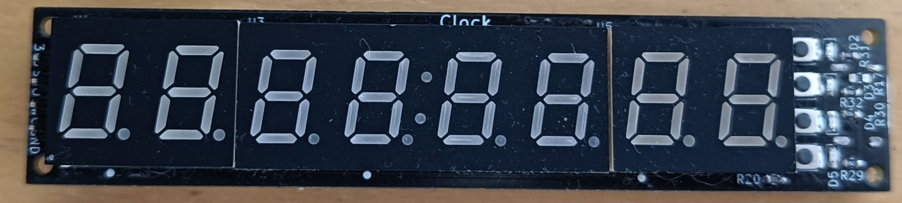
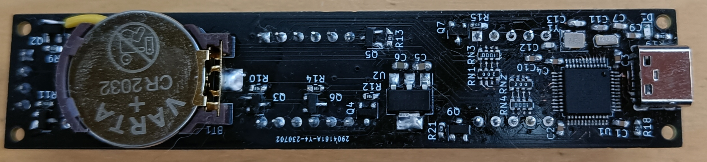
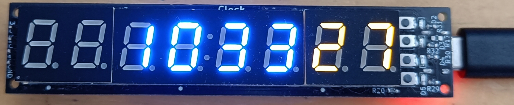
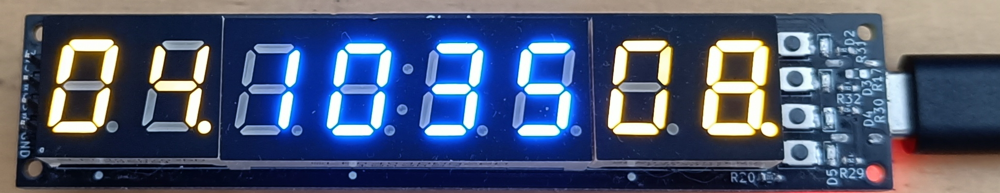

# Simple clock
This is just a small project that aims to make a simple clock, using STM32F103C8T6.
The clock will be shown on a seven segment display. There will be multiple modes to show
on the clock display.

## HW
STM32F103C8T6 is used as the _brains_. It has RTC that may be powered by CR2032 battery.
It's connected to a USB header, allowing to communicate with a computer. The chip is capable
of being a device, only, not host.
There is a header with 3V3, SWDIO, SWCLK, GND to allow programming the chip using a tool such as STLink.
ASM1117-3.3 is used for stepping down from 5V to 3V3.
3V3 should not be connected whilst USB is connected as well. This would short output of the LDO to 3V3.
There is no protection!

There are 8 seven segment displays,
4 of them are blue, 4 of them are yellow, the whole display looks like this: Y.Y.BB:BBY.Y.
(Y for yellow digit, B for blue digit)
There are 4 LEDs and 4 buttons, the LEDs are next to the buttons, making each LED "associated" with a button.
That makes it possible to light up an LED next to button, if the button is pressed etc.

The digits of the seven segment display are connected to PNP transistors.
When pulling the pin connected to the transistor low, the digit is turned on.
The pins used may be connected to timers, and PWM may be utilized to set
brightness.
Segments get turned on by being low as well.

Mapping of pins to peripherals is documented in [pins](docs/pins.md).

## Features / Roadmap

- [x] Remember date, time
  - [x] Time
  - [x] Date
- [x] Set time and date using simple interface
- [x] Switch between view modes by button
- [x] Show time, date
- [x] Adjust brightness using PWM
- [x] Auto adjust brightness based on time
- [ ] Stopwatch
- [ ] USB communication
  - [ ] Set time, Get time
  - [ ] Show arbitrary text or number on the display
  - [ ] Start stopwatch

## Images of the clock
### Front, off

### Back

### Front, with seconds

### Front, with clock and date

## What's next
Unfortunately, I did not solder the USB correctly on my board, so I cannot
currently test sending and receiving data using the USB, that is the reason
why the current program does not even support USB. In the future, the firmware
should support USB communication and a program for a computer should be made,
with some kind of CLI for communication with the board.
